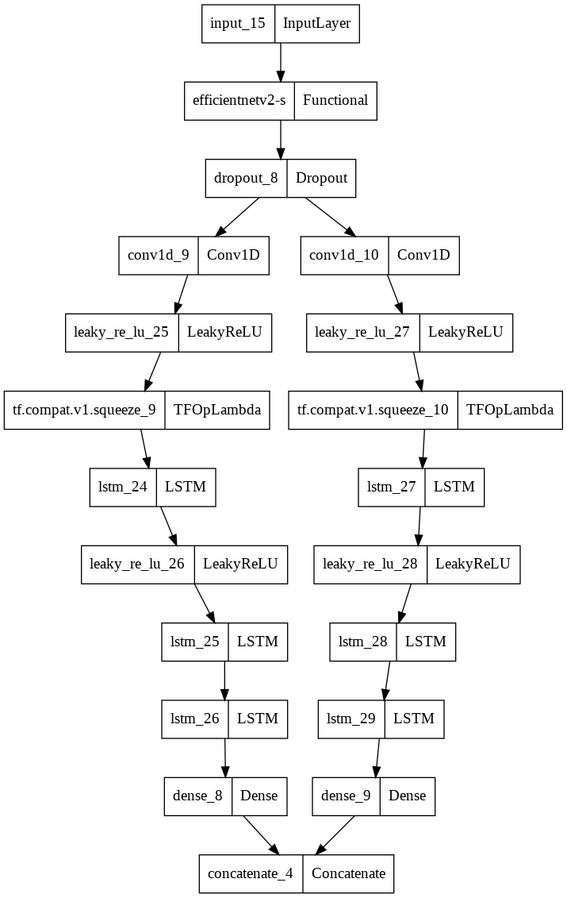

# Offroad Lane Detection

A deep learning-based solution for detecting and modeling natural path boundaries in offroad environments using Bezier curves and temporal self-attention.

## Overview

 
This project tackles the challenging problem of detecting natural path boundaries in unstructured offroad environments. Unlike traditional lane detection systems designed for well-marked roads, this solution uses a custom CNN architecture using transfer learning combined with Bezier curves to model irregular natural boundaries. The system incorporates temporal self-attention to reduce prediction fluctuations by considering past predictions.

## Key Features

- Custom dataset creation pipeline:
  - Video to image frame extraction
  - Manual annotation of boundary mesh points
  - Mesh point processing to fit optimal 4-point Bezier curves
- Deep learning model:
  - CNN-based architecture for boundary detection
  - Bezier curve parameter prediction
  - Temporal self-attention post-processing using past N frames
- Complete training and inference pipeline
- TensorBoard integration for visualization

## Dataset

The custom dataset is available on [Kaggle](https://www.kaggle.com/datasets/vaidiknakrani/offroad-shape-detection). It includes:
- Raw video frames from offroad environments
- Manual annotations of boundary mesh points
- Processed Bezier curve control points
- Training/validation split

## Model Architecture

